# Capstone Project

 Capstone project is part of the Udacity Azure ML Nanodegree. In this project, I have used Heart Failure Prediction dataset from Kaggle to build a classification model. It consist of two models: one using Automated ML and one customized model whose hyperparameters are tuned using HyperDrive. The performance of models are compared and deployed the best performing model as a webservice. 

## Project Workflow

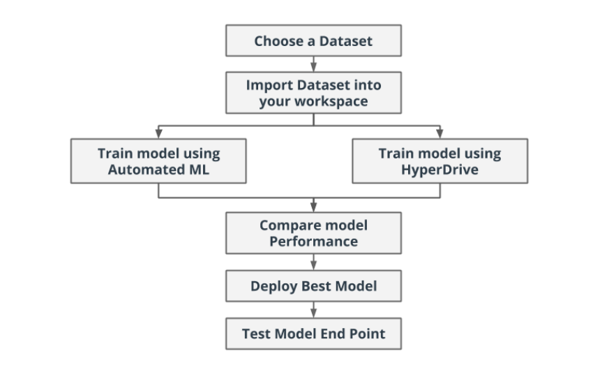


##  Overview
Dataset is downloaded from Kaggle and used through Github. 

Heart failure is a common event caused by CVDs. Most cardiovascular diseases can be prevented by addressing behavioural risk factors such as tobacco use, unhealthy diet and obesity, physical inactivity and harmful use of alcohol using population-wide strategies.

People with cardiovascular disease or who are at high cardiovascular risk (due to the presence of one or more risk factors such as hypertension, diabetes, hyperlipidaemia or already established disease) need early detection and management wherein a machine learning model can be of great help.

Thus, I have performed Logistic Regression on the this Dataset inorder to predict the mortality by heart failure.


### Task
 This dataset contains 12 features that can be used to predict mortality by heart failure. The target ("DEATH_EVENT") is either 1 or 0, column with values of 1 means person will suffer from heart failure and 0 means no heart failure.

### Access
I have downloaded the data from Kaggle https://www.kaggle.com/andrewmvd/heart-failure-clinical-data and uploaded to my github. The dataset can be loaded in the Notebook by providing the raw url of the dataset.

## Automated ML
**Automated machine learning**, also referred to as automated ML or AutoML, is the process of automating the time consuming, iterative tasks of machine learning model development. It allows data scientists, analysts, and developers to build ML models with high scale, efficiency, and productivity all while sustaining model quality.

AutoML config has following parameters:

| Parameter                   | Value                  | Usage                                                                               |
| ----------------------------|:-----------------------|                                                      ---------------------------------:|
|enable_early_stopping        |True                    | To enable early termination if the score is not improving in the short term|
|max_concurrent_iterations    |5                      | To specify the maximum number of iterations that would be executed in parallel. | 
|featurization                |auto                    | To specify wherether featurization should be done automically or not, auto is ued to do it automatically.| 
|experiment_timeout_minutes   |30                    | To specify how long in minutes, our experiment should continue to run         |
|task                         |classification                     | We are going to solve the classification problem| 
|primary_metric               |accuracy                       | The metric that Automated Machine Learning will optimize for model selection. We are going to optimize the Accuracy.| 
|compute_target               |compute_target                    | To run teh Automated Machine learning experiment, we are going to use remote created compute cluster | 
|training_data                |ds                   | To specify wherether featurization should be done automically or not, auto is ued to do it automatically.| 
|label_column_name            |DEATH_EVENT                  | This is the model value to predict, our lable column is 'Outcome'.| 
|n_cross_validations          |3                    | How many cross validations to perform when user validation data is not specified.| 
|debug_log                    |automl_errors.log                    | The log file to write debug information|

<br>

Automated machine learning supports ensemble models. **Ensemble learning** improves machine learning results and predictive performance by combining multiple models as opposed to using single models. AutoML uses both **voting ensemble** and **stacking ensemble** methods for combining models.

### Results

AutoML rapidly iterates over many combinations of algorithms and hyperparameters, and find out the best model based on a **Accuracy** success metric.**Best run model** for the bank-marketing dataset is **VotingEnsemble**. **Voting Ensemble** technique predicts based on the weighted average of predicted class probabilities for classification tasks.

 **Best run model** is **VotingEnsemble**(Best Run Id:  AutoML_6263dfa7-5f5f-4c49-a41d-906612c208c9_38) with a accuracy of **0.8561616161616162**.


Azure AutoML machine learning provides charts and metrics, to identify overfitted and imbalanced data, and implements best practices to help mitigate them. Inorder to decrease this model bias and to improve model accuracy, **Class balancing of Data** and **Cross validation** is required.


**AutoML Run Widget Details**

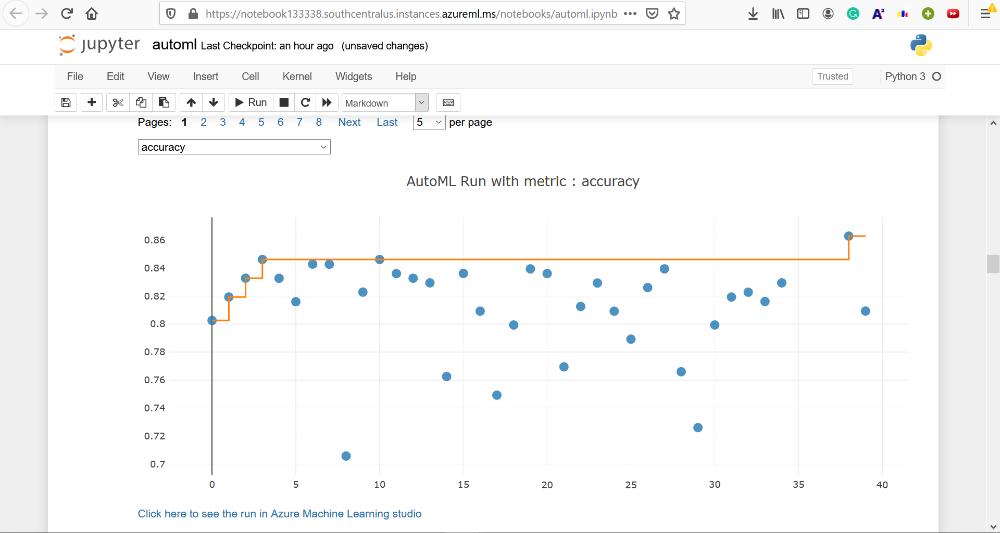
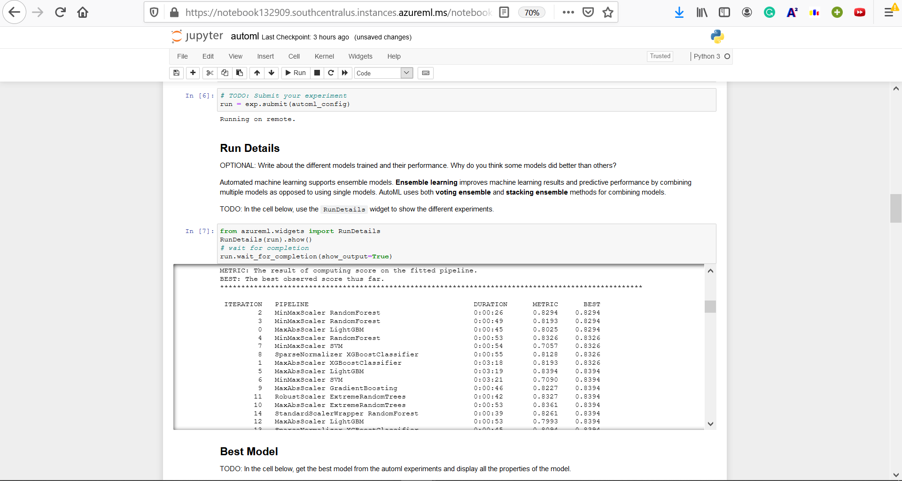

**AutoML Best Run Details**

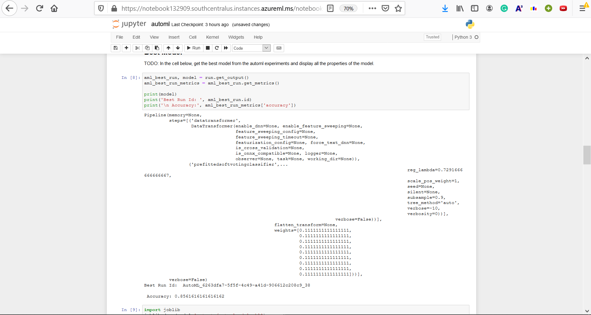
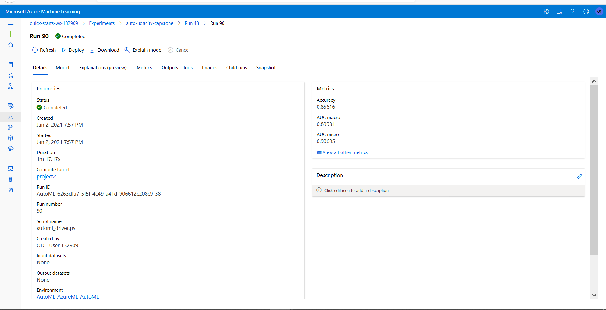

 **Voting Ensemble: Best Model**

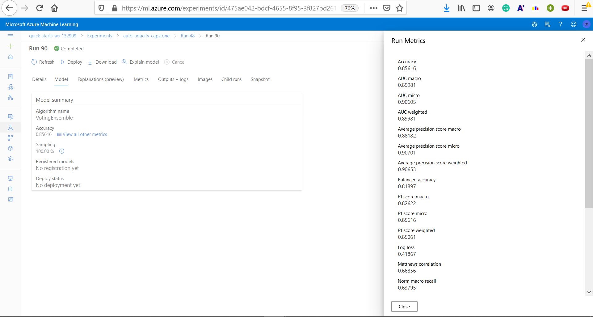


## Hyperparameter Tuning

In Scikit-learn Pipeline for Heart-Failure-Prediction ,first of all, clean_data function remove NaN and split it into x and y. This transformed data, then splitted into training and test set in order to perform Logistic Regression.

Logistic Regression is a binary classification algorithm(0 or 1).  It uses logistic function called the sigmoid function in order to predict outcomes. 

**Hyperparameters** are adjustable parameters that controls the model training process. Hyperparameters of logistic regression are max-iterations and regularization strength. Hyperdrive is used to tune them. **Hyperparameter tuning** is the process of finding the configuration of hyperparameters that results in the best performance. With help of hyperdrive, hyperparameters of Logistic Regression are optimized and accuracy is calculated. 

In order to determine max-iterations and regularization strength, **RandomParameterSampling** parameter sampler is used. In this sampling algorithm, parameter values are randomly chosen from a set of discrete values or a distribution over a continuous range. In the search space two parameters are defined, --C and --max-iter.The **--C**  have a uniform distribution with 0.5 as a minimum value and 1.5 as a maximum value, and the **--max-iter** will be a choice of [16, 32, 64, 128]. Random Sampling supports early termination of low-performance runs. Thus, provides ease of exploration and efficiency. Some users do an initial search with random sampling and then refine the search space to improve results. The best run model has hyperparameters, 
['--C', '1.396527698242271', '--max_iter', '128']

During hyperdrive configuration, **BanditPolicy** is chosen as an early termination policy. Bandit policy is based on slack factor/slack amount and evaluation interval. It terminates runs where the primary metric is not within the specified slack factor/slack amount (poorly performing runs) compared to the best performing run. Thus, improves computational efficiency. In this project, the early termination policy is applied at every even interval when metrics are reported. Any run whose best metric is less than (1/(1+0.1) or 91% of the best performing run will be terminated.

The **best run model** for Hyperdrive (Best Run Id:) HD_90d16957-976c-41c5-ade7-5c9291bee04f_2 .


### Results

Best Run Model and its hyperparameters:

```
['--C', '1.396527698242271', '--max_iter', '128']

Best Run Id:  HD_90d16957-976c-41c5-ade7-5c9291bee04f_2

Accuracy: 0.8

```

For scikit-learn pipeline, taking different range of values for hyperparameters (--C and --max-iter) or  using different Logistic Regression **solver** (such as  [‘newton-cg’, ‘lbfgs’, ‘liblinear’, ‘sag’, ‘saga’]) will help in improving performance of model and choosing more robust model. Performing **Cross validation** in Scikit-Learn Pipeline will help in overcoming **overfitting of data** thus, improve performance of model in future.

**HyperDrive Run Widget Details**

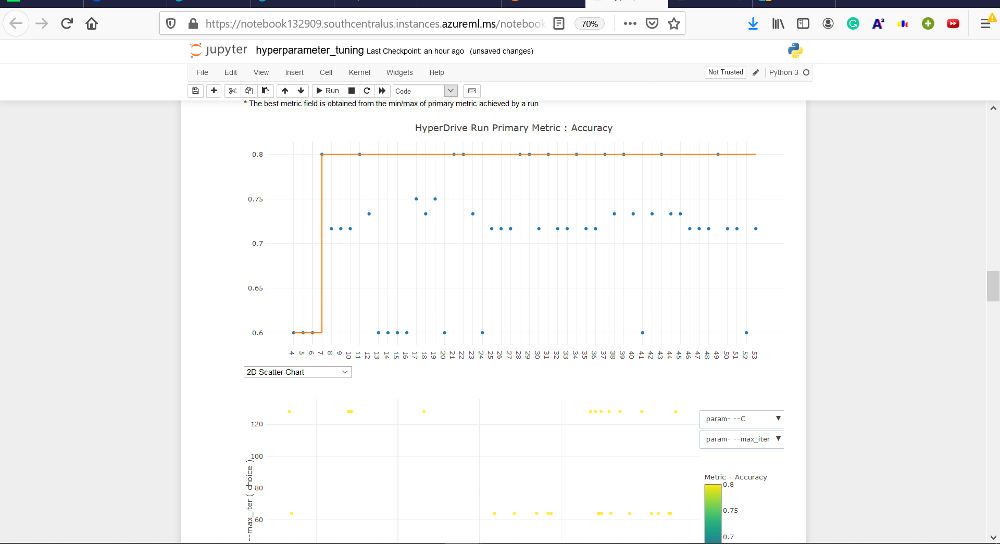
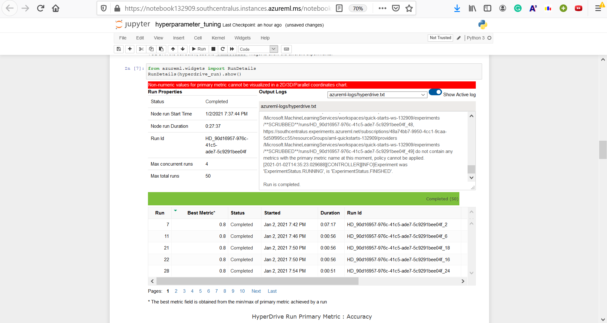
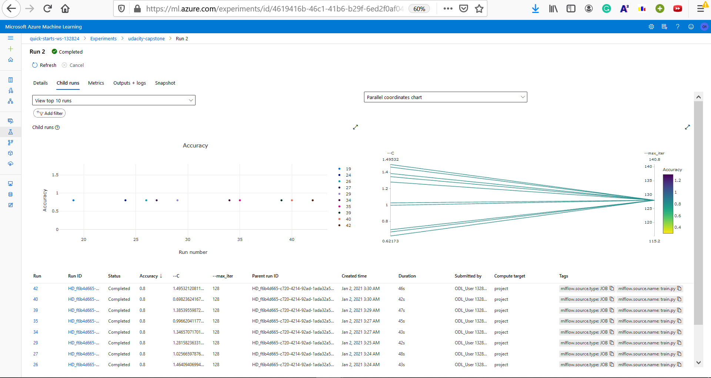

**HyperDrive Best Run Details**

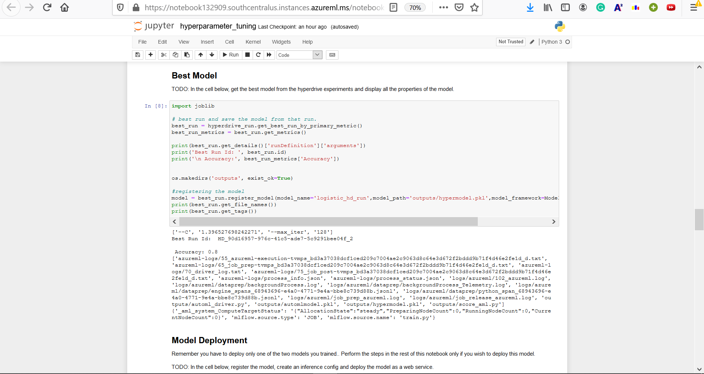


## Model Deployment

The best model from HyperDrive experiment is of accuracy: 80% and the best model from Auto ML experiment is of accuracy: 85%. So, best model is the Automl run model with accuracy 85%. 

- First of all, I have saved best run model as .pkl and registered in Azure studio. Also, wrote scoring script.
- Created an ACI deployment configuration with key-based auth enabled.
-  Configured InferenceConfig by providing the scoring script as entry script and environment 
- Then Deployed the Model by providing the model, deployment-configuration (aciConfig) andd inference-configuration.

**Endpoint of Automl Run**

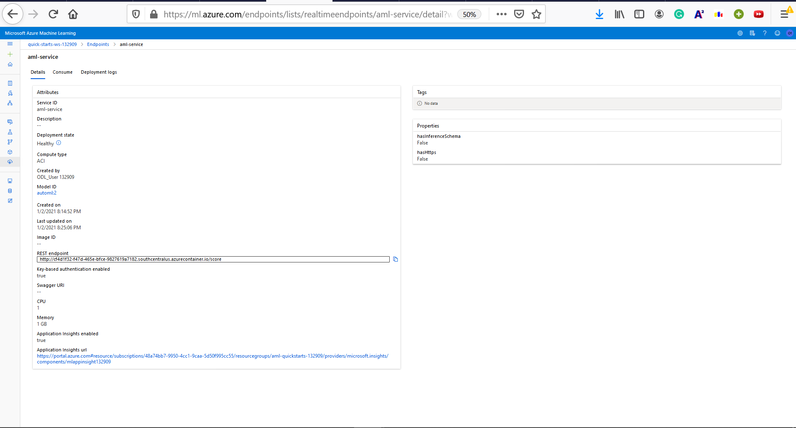

**Endpoint of HyperDrive Run**

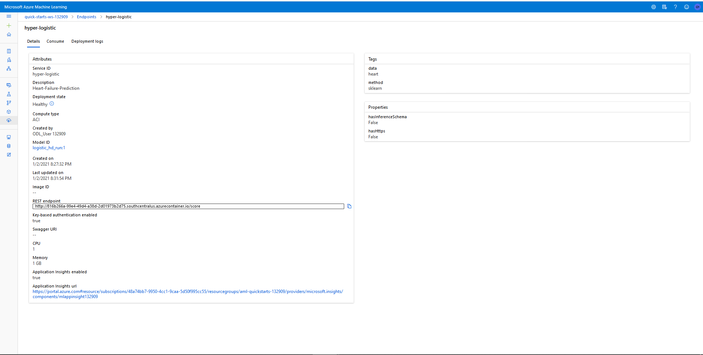

- After deployment of the machine learning model as web-service, query the web-service-endpoint by sending the request to it.
- The REST API expects the body of the request to be a JSON document. The following image shows the post-request sent and its output.

**Rest-Call to the Endpoint**

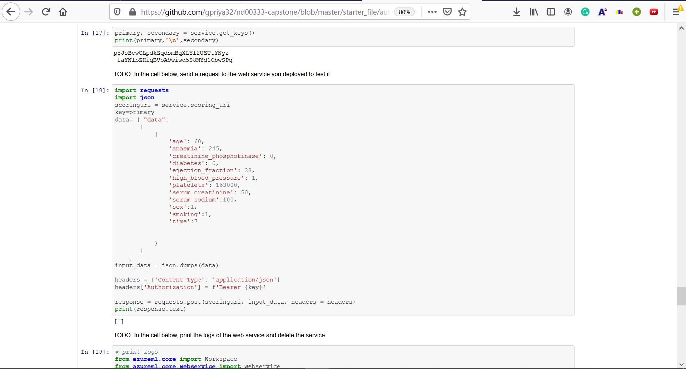

Steps for querying the endpoint :

- Require scoring uri, json data and primary key 
- Json data (sample input) should be structured in the given format 

```
    data= { "data":
        [
            {
                'age': 60,
                'anaemia': 245,
                'creatinine_phosphokinase': 0,
                'diabetes': 0,
                'ejection_fraction': 38,
                'high_blood_pressure': 1,
                'platelets': 163000,
                'serum_creatinine': 50,
                'serum_sodium':100,
                'sex':1,
                'smoking':1,
                'time':7
                
                
            }
        ]
        }
    input_data = json.dumps(data)
```
- Create the header with key "Content-Type" and value "application/json" and also, set the value of Authorization with Bearer token and primary key.
- Then, Post-request is sent to the web-servive and succesfull response is obtained.


## Screen Recording

Drive link : https://drive.google.com/file/d/1kglRuik2-XgjjgqpokO-HTkFxR11Qy0j/view?usp=sharing

## Standout Suggestions

Enabled logging in deployed web app: Log useful data about requests being sent to the web-app.

```
service.update(enable_app_insights=True)
```
**Enabled Logging**

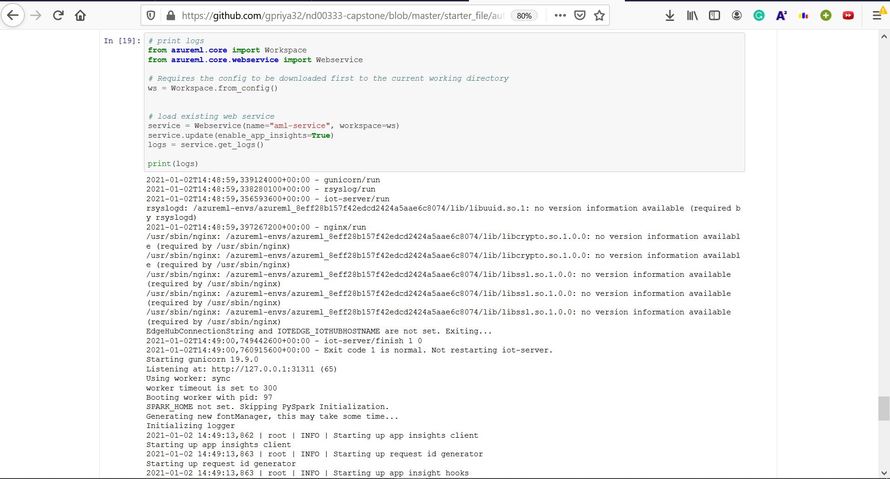